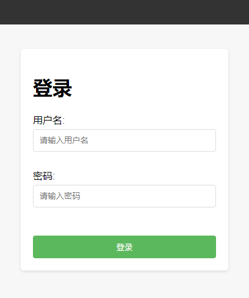

# ip_allow
Add "allow" firewall rule after checking username and password.

## 目的

提供一个登录页面，当用户登录成功后，将用户的访问IP在防火墙规则中放行。



## 使用步骤

```bash

$ cd ./ip_allow
$ pip install -r conf/requirements.txt
or 
$ pip install flask
$ python ./app.py
 * Serving Flask app 'app'
 * Debug mode: off
```

默认使用 80 端口作为服务端口，可以在 app.py 中修改服务端口
```python
if __name__ == '__main__':
    app.run(debug=False, host='0.0.0.0', port=80)
```

## 日志

用户的所有访问日志都存于 ./logs/app.log 中，其中登录成功的日志会单独存于 ./logs/allow.log 中， 登录失败的日志会存于 ./logs/deny.log 中。
日志中存储了访问者的 `IP|username|password` ， 可用于蜜罐、 钓鱼、 反入侵等事后分析。

## 默认密码

系统的默认用户密码为：

```python
# 用户demo数据，请换成自己的用户数据源
users = {
    "admin": "nzDrdSKN9JS5IGhZkwxs",
    "user": "HIAExuX81QWw4KyM8P3W"
}
```
可将代码中的用户数据换成自己的用户数据或更换认证策略。